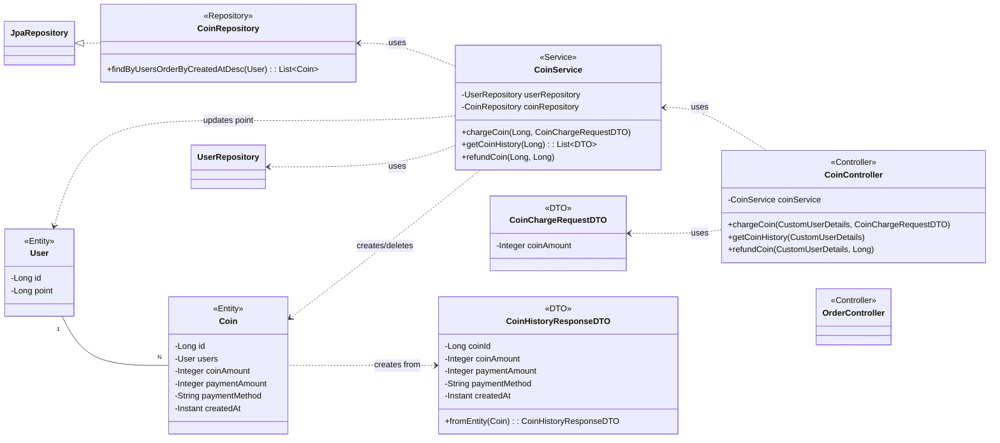

## 결제 및 코인 시스템 class diagram
#### orderController 는 미완.

```mermaid
classDiagram
    direction RL

    class CoinController {
        <<Controller>>
        -CoinService coinService
        +chargeCoin(CustomUserDetails, CoinChargeRequestDTO)
        +getCoinHistory(CustomUserDetails)
        +refundCoin(CustomUserDetails, Long)
    }

    class CoinService {
        <<Service>>
        -UserRepository userRepository
        -CoinRepository coinRepository
        +chargeCoin(Long, CoinChargeRequestDTO)
        +getCoinHistory(Long) : List~DTO~
        +refundCoin(Long, Long)
    }

    class CoinRepository {
        <<Repository>>
        +findByUsersOrderByCreatedAtDesc(User) : List~Coin~
    }

    class Coin {
        <<Entity>>
        -Long id
        -User users
        -Integer coinAmount
        -Integer paymentAmount
        -String paymentMethod
        -Instant createdAt
    }

    class OrderController {
        <<Controller>>
    }

    class CoinChargeRequestDTO {
        <<DTO>>
        -Integer coinAmount
    }

    class CoinHistoryResponseDTO {
        <<DTO>>
        -Long coinId
        -Integer coinAmount
        -Integer paymentAmount
        -String paymentMethod
        -Instant createdAt
        +fromEntity(Coin) : CoinHistoryResponseDTO
    }

    class User {
        <<Entity>>
        -Long id
        -Long point
    }

    %% --- Relationships ---
    CoinController ..> CoinService : uses
    CoinController ..> CoinChargeRequestDTO : uses
    
    CoinService ..> CoinRepository : uses
    CoinService ..> UserRepository : uses
    CoinService ..> Coin : creates/deletes
    CoinService ..> User : updates point
    
    CoinRepository ..|> JpaRepository
    
    Coin "N" -- "1" User

    CoinHistoryResponseDTO <.. Coin : creates from
```