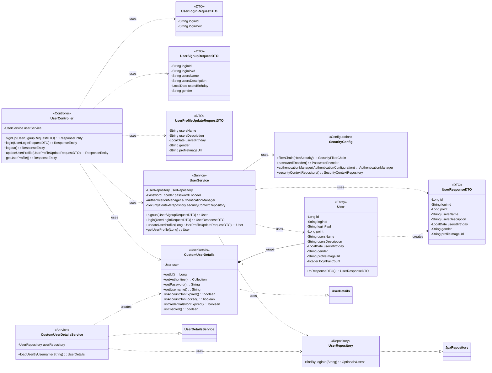

## 회원관리 class diagram

```mermaid
classDiagram
    direction LR

    class UserLoginRequestDTO {
        <<DTO>>
        -String loginId
        -String loginPwd
    }
    class UserSignupRequestDTO {
        <<DTO>>
        -String loginId
        -String loginPwd
        -String usersName
        -String usersDescription
        -LocalDate usersBirthday
        -String gender
    }
    class UserProfileUpdateRequestDTO {
        <<DTO>>
        -String usersName
        -String usersDescription
        -LocalDate usersBirthday
        -String gender
        -String profileImageUrl
    }
    class UserResponseDTO {
        <<DTO>>
        -Long id
        -String loginId
        -Long point
        -String usersName
        -String usersDescription
        -LocalDate usersBirthday
        -String gender
        -String profileImageUrl
    }

    class UserController {
        <<Controller>>
        -UserService userService
        +signUp(UserSignupRequestDTO) : ResponseEntity
        +login(UserLoginRequestDTO) : ResponseEntity
        +logout() : ResponseEntity
        +updateUserProfile(UserProfileUpdateRequestDTO) : ResponseEntity
        +getUserProfile() : ResponseEntity
    }
    class UserService {
        <<Service>>
        -UserRepository userRepository
        -PasswordEncoder passwordEncoder
        -AuthenticationManager authenticationManager
        -SecurityContextRepository securityContextRepository
        +signup(UserSignupRequestDTO) : User
        +login(UserLoginRequestDTO) : UserResponseDTO
        +updateUserProfile(Long, UserProfileUpdateRequestDTO) : User
        +getUserProfile(Long) : User
    }
    class CustomUserDetailsService {
        <<Service>>
        -UserRepository userRepository
        +loadUserByUsername(String) : UserDetails
    }
    class CustomUserDetails {
        <<UserDetails>>
        -User user
        +getId() : Long
        +getAuthorities() : Collection
        +getPassword() : String
        +getUsername() : String
        +isAccountNonExpired() : boolean
        +isAccountNonLocked() : boolean
        +isCredentialsNonExpired() : boolean
        +isEnabled() : boolean
    }
    class SecurityConfig {
        <<Configuration>>
        +filterChain(HttpSecurity) : SecurityFilterChain
        +passwordEncoder() : PasswordEncoder
        +authenticationManager(AuthenticationConfiguration) : AuthenticationManager
        +securityContextRepository() : SecurityContextRepository
    }
    class User {
        <<Entity>>
        -Long id
        -String loginId
        -String loginPwd
        -Long point
        -String usersName
        -String usersDescription
        -LocalDate usersBirthday
        -String gender
        -String profileImageUrl
        -Integer loginFailCount
        +toResponseDTO() : UserResponseDTO
    }
    class UserRepository {
        <<Repository>>
        +findByLoginId(String) : Optional~User~
    }

    UserController ..> UserService : uses
    UserController ..> CustomUserDetails : uses
    UserController ..> UserLoginRequestDTO : uses
    UserController ..> UserSignupRequestDTO : uses
    UserController ..> UserProfileUpdateRequestDTO : uses
    
    UserService ..> UserRepository : uses
    UserService ..> User : uses
    UserService ..> UserResponseDTO : uses
    UserService ..> SecurityConfig : uses
    
    CustomUserDetailsService ..> UserRepository : uses
    CustomUserDetailsService ..> CustomUserDetails : creates
    CustomUserDetailsService ..|> UserDetailsService

    CustomUserDetails ..|> UserDetails
    CustomUserDetails "1" *-- "1" User : wraps
    
    UserRepository ..|> JpaRepository
    
    User ..> UserResponseDTO : creates

```