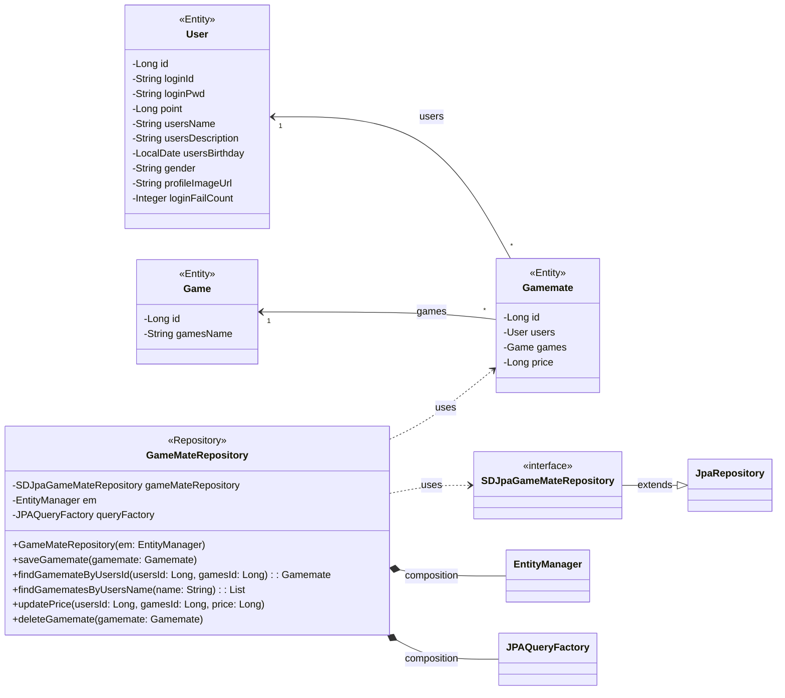

## gamemate class diagram

## Gamemate 클래스 정보

| 구분             | Name         | Type | Visibility | Description                                    |
|:---------------|:-------------|:-----|:-----------|:-----------------------------------------------|
| **class**      | **Gamemate** |      |            | 데이터베이스의 gamemates 테이블과 매핑되는 JPA 객체             |
| **Attributes** | id           | Long | private    | DB의 PK로서 gamemates_id 컬럼과 매핑되는 변수              |
|                | users        | User | private    | DB의 users_id 컬럼과 매핑되는 변수로 User의 정보를 받아오기 위한 변수 |
|                | games        | Game | private    | DB의 games_id 컬럼과 매핑되는 변수로 Game의 정보를 받아오기 위한 변수 |
|                | price        | Long | private    | DB의 price 컬럼과 매핑되는 변수로 게임 당 단가를 저장하는 변수        |

## Game 클래스 정보

| 구분             | Name      | Type   | Visibility | Description                                      |
|:---------------|:----------|:-------|:-----------|:-------------------------------------------------|
| **class**      | **Game**  |        |            | 데이터베이스의 game 테이블과 매핑되는 JPA 객체                    |
| **Attributes** | id        | Long   | private    | DB의 PK로서 games_id 컬럼과 매핑되는 변수                    |
|                | gamesName | String | private    | DB의 games_name 컬럼과 매핑되는 변수로 game의 이름을 가져오기 위한 변수 |

## GameMateRepository 클래스 정보

| 구분             | Name                     | Type                    | Visibility | Description                                   |
|:---------------|:-------------------------|:------------------------|:-----------|:----------------------------------------------|
| **class**      | **GameMateRepository**   |                         |            | DB에 저장된 게임메이트 정보를 생성, 수정, 삭제, 조회를 위한 class    |
| **Attributes** | gameMateRepository       | SDJpaGameMateRepository | private    | 생성, 수정, 삭제, 조회 쿼리를 쉽게 사용하기 위한 Spring Data JPA |
|                | em                       | EntityManager           | private    | 엔티티 객체를 관리해주는 객체                              |
|                | queryFactory             | JPAQueryFactory         | private    | Query DSL 기능을 사용하기 위한 객체                      |
| **Operations** | GameMateRepository       | void                    | public     | GameMateRepository 클래스 생성 및 초기화하는 생성자         |
|                | saveGamemate             | void                    | public     | 게임메이트 정보를 DB에 저장하는 함수                         |
|                | findGamemateByUsersId    | Gamemate                | public     | DB에 저장된 게임메이트 정보를 사용자ID를 통해 조회하여 반환하는 함수      |
|                | findGamematesByUsersName | List<Gamemate>          | public     | DB에 저장된 게임메이트 정보를 사용자 이름을 통해 조회하여 반환하는 함수     |
|                | updatePrice              | void                    | public     | 사용자가 초기에 설정해놓은 게임 당 단가를 변경하는 함수               |
|                | deleteGamemate           | void                    | public     | 게임메이트 정보를 DB에서 삭제하는 함수                        |