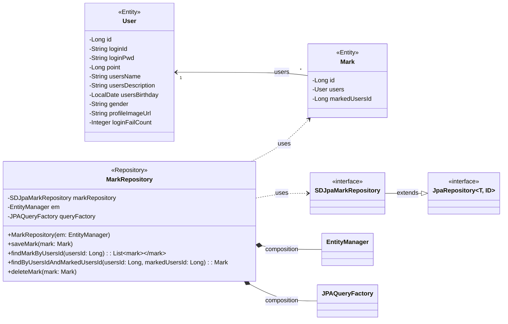

## mark class diagram

## Mark 클래스 정보

| 구분             | Name          | Type | Visibility | Description                                                        |
|:---------------|:--------------|:-----|:-----------|:-------------------------------------------------------------------|
| **class**      | **Mark**      |      |            | 데이터베이스의 mark 테이블과 매핑되는 JPA 객체                                      |
| **Attributes** | id            | Long | private    | DB의 PK로서 marks_id 컬럼과 매핑되는 변수                                      |
|                | users         | User | private    | DB의 users_id 컬럼과 매핑되는 변수로 User의 정보를 받아오기 위한 변수                     |
|                | markedUsersId | Long | private    | DB의 marked_users_id 컬럼과 매핑되는 변수로 즐겨찾기로 등록한 다른 사용자ID 정보를 받아오기 위한 변수 |
|                | price         | Long | private    | DB의 price 컬럼과 매핑되는 변수로 게임 당 단가를 저장하는 변수                            |

## MarkRepository 클래스 정보

| 구분             | Name                          | Type                | Visibility | Description                                   |
|:---------------|:------------------------------|:--------------------|:-----------|:----------------------------------------------|
| **class**      | **MarkRepository**            |                     |            | DB에 저장된 즐겨찾기 정보를 생성, 수정, 삭제, 조회를 위한 class     |
| **Attributes** | markRepository                | SDJpaMarkRepository | private    | 생성, 수정, 삭제, 조회 쿼리를 쉽게 사용하기 위한 Spring Data JPA |
|                | em                            | EntityManager       | private    | 엔티티 객체를 관리해주는 객체                              |
|                | queryFactory                  | JPAQueryFactory     | private    | Query DSL 기능을 사용하기 위한 객체                      |
| **Operations** | MarkRepository                | void                | public     | markRepository 클래스 생성 및 초기화하는 생성자             |
|                | saveMark                      | void                | public     | 즐겨찾기 정보를 DB에 저장하는 함수                          |
|                | findMarkByUsersId             | List<Mark>          | public     | DB에 저장된 즐겨찾기 정보를 사용자ID를 통해 조회하여 반환하는 함수       |
|                | findByUsersIdAndMarkedUsersId | Mark                | public     | 사용자ID를 통해 DB에 즐겨찾기로 등록된 특정 사용자를 조회하여 반환하는 함수  |
|                | deleteMark                    | void                | public     | 즐겨찾기 정보를 DB에서 삭제하는 함수                         |