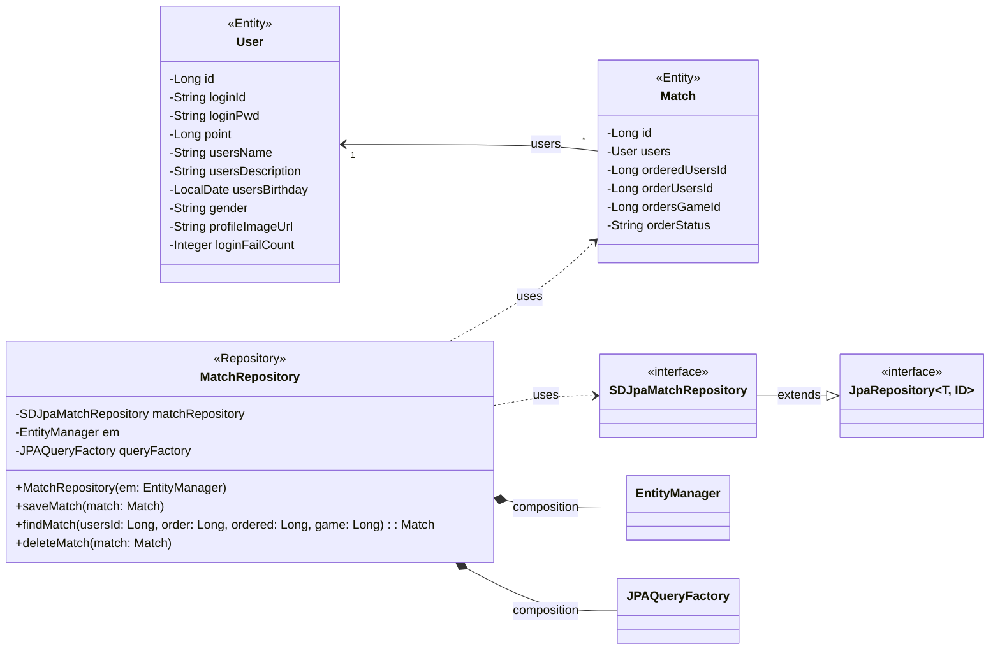

## match class diagram

## Match 클래스 정보

| 구분             | Name           | Type   | Visibility | Description                                                |
|:---------------|:---------------|:-------|:-----------|:-----------------------------------------------------------|
| **class**      | **Match**      |        |            | 데이터베이스의 matches 테이블과 매핑되는 JPA 객체                           |
| **Attributes** | id             | Long   | private    | DB의 PK로서 orders_id 컬럼과 매핑되는 변수                             |
|                | users          | User   | private    | DB의 users_id 컬럼과 매핑되는 변수로 User의 정보를 받아오기 위한 변수             |
|                | orderedUsersId | Long   | private    | DB의 ordered_users_id 컬럼과 매핑되는 변수로 매칭 주문을 받은 사용자ID를 저장하는 변수 |
|                | orderUsersId   | Long   | private    | DB의 order_users_id 컬럼과 매핑되는 변수로 매칭 주문을 한 사용자ID를 저장하는 변수    |
|                | ordersGameId   | Long   | private    | DB의 orders_game_id 컬럼과 매핑되는 변수로 매칭된 게임ID를 저장하는 변수          |
|                | orderStatus    | String | private    | DB의 order_status 컬럼과 매핑되는 변수로 매칭 주문의 수락 여부를 저장하는 변수        |

## MatchRepository 클래스 정보

| 구분             | Name                | Type                 | Visibility | Description                                            |
|:---------------|:--------------------|:---------------------|:-----------|:-------------------------------------------------------|
| **class**      | **MatchRepository** |                      |            | DB에 저장된 사용자와 게임메이트 사이에 매칭 정보를 생성, 수정, 삭제, 조회를 위한 class |
| **Attributes** | matchRepository     | SDJpaMatchRepository | private    | 생성, 수정, 삭제, 조회 쿼리를 쉽게 사용하기 위한 Spring Data JPA          |
|                | em                  | EntityManager        | private    | 엔티티 객체를 관리해주는 객체                                       |
|                | queryFactory        | JPAQueryFactory      | private    | Query DSL 기능을 사용하기 위한 객체                               |
| **Operations** | MatchRepository     | void                 | public     | matchRepository 클래스 생성 및 초기화하는 생성자                     |
|                | saveMatch           | void                 | public     | 매칭 정보를 DB에 저장하는 함수                                     |
|                | findMatch           | Match                | public     | DB에 저장된 사용자와 게임메이트 사이에 매칭 정보를 조회하여 반환하는 함수             |
|                | deleteMatch         | void                 | public     | 매칭 정보를 DB에서 삭제하는 함수                                    |