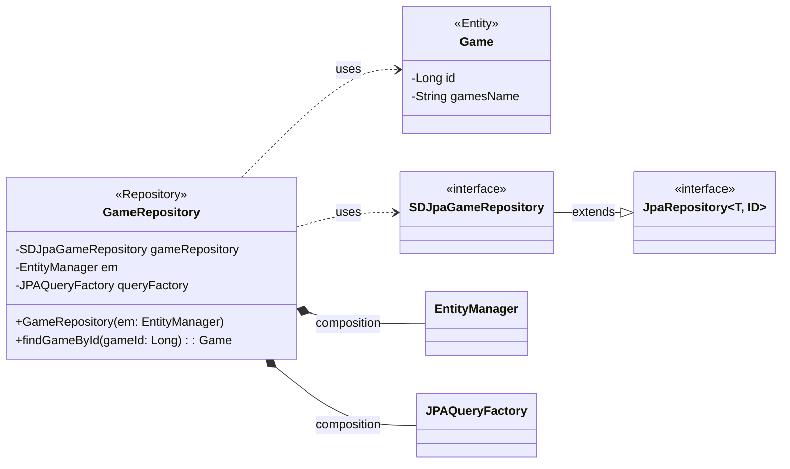

## game class diagram

```mermaid
    classDiagram
    direction LR
    
    class GameRepository {
        <<Repository>>
        -SDJpaGameRepository gameRepository
        -EntityManager em
        -JPAQueryFactory queryFactory
        +GameRepository(em: EntityManager)
        +findGameById(gameId: Long): Game
    }

    class Game {
        <<Entity>>
        -Long id
        -String gamesName
    }

    class SDJpaGameRepository {
        <<interface>>
    }

    class EntityManager {
    }

    class JPAQueryFactory {
    }

    class JpaRepository~T, ID~ {
        <<interface>>
    }

    %% Relationships
    SDJpaGameRepository --|> JpaRepository : extends
    GameRepository ..> SDJpaGameRepository : uses
    GameRepository *-- EntityManager : composition
    GameRepository *-- JPAQueryFactory : composition
    GameRepository ..> Game : uses

```