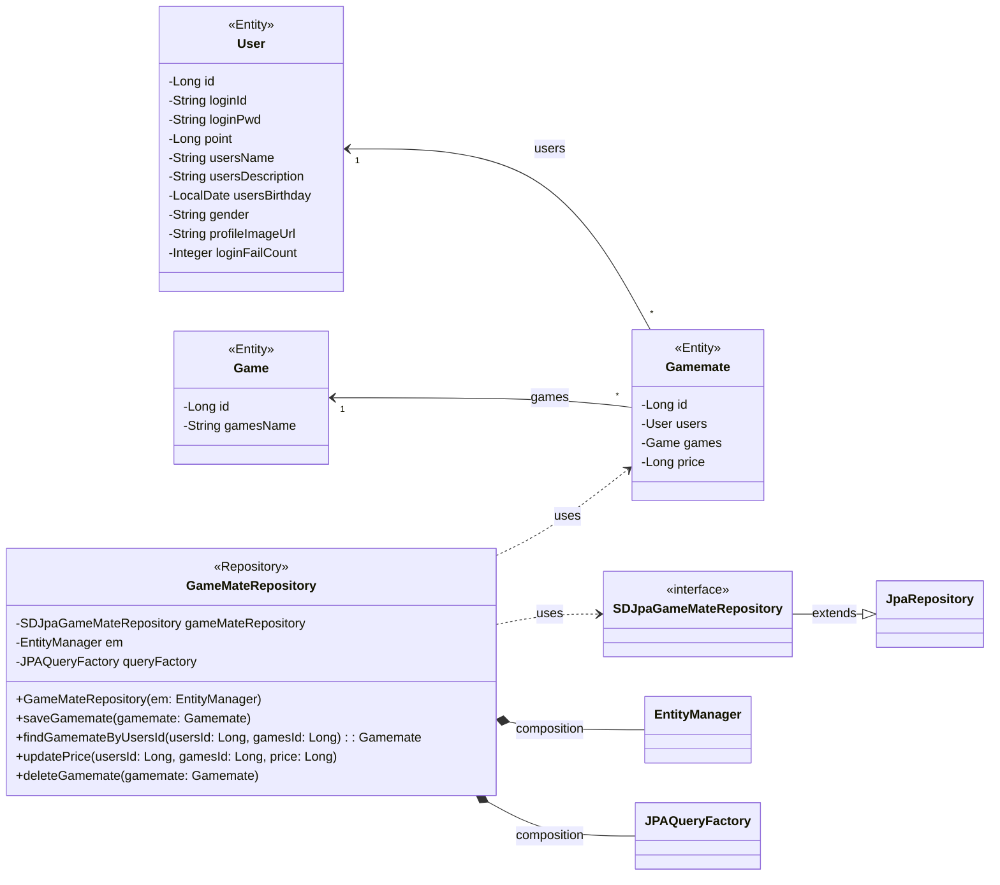

## gamemate class diagram

## GameMateRepository 클래스 정보

| 구분 | Name | Type | Visibility | Description |
| :--- | :--- | :--- | :--- | :--- |
| **class** | **GameMateRepository** | | | DB에 저장된 게임메이트 정보를 생성, 수정, 삭제, 조회를 위한 class |
| **Attributes** | gameMateRepository | SDJpaGameMateRepository | private | 생성, 수정, 삭제, 조회 쿼리를 쉽게 사용하기 위한 Spring Data JPA |
| | em | EntityManager | private | 엔티티 객체를 관리해주는 객체 |
| | queryFactory | JPAQueryFactory | private | Query DSL 기능을 사용하기 위한 객체 |
| **Operations** | GameMateRepository | void | public | GameMateRepository 클래스 생성 및 초기화하는 생성자 |
| | saveGamemate | void | public | 게임메이트 정보를 DB에 저장하는 함수 |
| | findGamemateByUsersId | Gamemate | public | DB에 저장된 게임메이트 정보를 사용자ID를 통해 가져오는 함수 |
| | updatePrice | void | public | 사용자가 초기에 설정해놓은 게임 당 단가를 변경하는 함수 |
| | deleteGamemate | void | public | 게임메이트 정보를 DB에서 삭제하는 함수 |