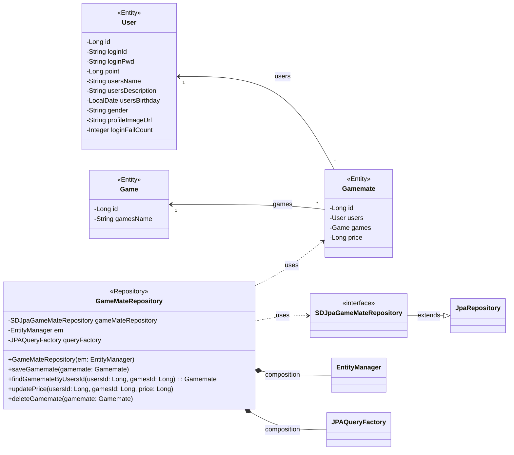

## gamemate class diagram

```mermaid
classDiagram
    direction LR
    
    class User {
        <<Entity>>
        -Long id
        -String loginId
        -String loginPwd
        -Long point
        -String usersName
        -String usersDescription
        -LocalDate usersBirthday
        -String gender
        -String profileImageUrl
        -Integer loginFailCount
    }

    class Game {
        <<Entity>>
        -Long id
        -String gamesName
    }

    class Gamemate {
        <<Entity>>
        -Long id
        -User users
        -Game games
        -Long price
    }
    
    class GameMateRepository {
        <<Repository>>
        -SDJpaGameMateRepository gameMateRepository
        -EntityManager em
        -JPAQueryFactory queryFactory
        +GameMateRepository(em: EntityManager)
        +saveGamemate(gamemate: Gamemate)
        +findGamemateByUsersId(usersId: Long, gamesId: Long): Gamemate
        +updatePrice(usersId: Long, gamesId: Long, price: Long)
        +deleteGamemate(gamemate: Gamemate)
    }

    class SDJpaGameMateRepository {
        <<interface>>
    }

    class EntityManager {
    }

    class JPAQueryFactory {
    }
    User "1" <-- "*" Gamemate : users
    Game "1" <-- "*" Gamemate : games
    GameMateRepository ..> SDJpaGameMateRepository : uses
    GameMateRepository *-- EntityManager : composition
    GameMateRepository *-- JPAQueryFactory : composition
    GameMateRepository ..> Gamemate : uses
    SDJpaGameMateRepository --|> JpaRepository : extends
```