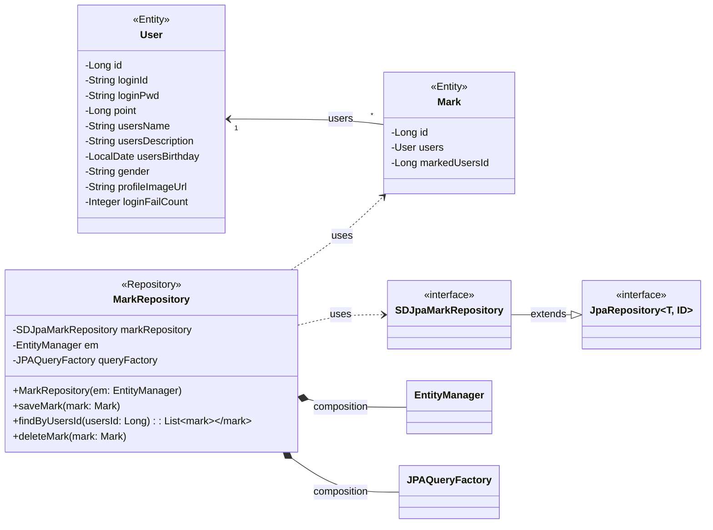

## mark class diagram

```mermaid

classDiagram
    direction LR

    class MarkRepository {
        <<Repository>>
        -SDJpaMarkRepository markRepository
        -EntityManager em
        -JPAQueryFactory queryFactory
        +MarkRepository(em: EntityManager)
        +saveMark(mark: Mark)
        +findByUsersId(usersId: Long): List<Mark>
        +deleteMark(mark: Mark)
    }

    class Mark {
        <<Entity>>
        -Long id
        -User users
        -Long markedUsersId
    }

    class User {
        <<Entity>>
        -Long id
        -String loginId
        -String loginPwd
        -Long point
        -String usersName
        -String usersDescription
        -LocalDate usersBirthday
        -String gender
        -String profileImageUrl
        -Integer loginFailCount
    }

    class SDJpaMarkRepository {
        <<interface>>
    }

    class EntityManager {
    }

    class JPAQueryFactory {
    }

    class JpaRepository~T, ID~ {
        <<interface>>
    }

    %% Relationships
    SDJpaMarkRepository --|> JpaRepository : extends
    MarkRepository ..> SDJpaMarkRepository : uses
    MarkRepository *-- EntityManager : composition
    MarkRepository *-- JPAQueryFactory : composition
    MarkRepository ..> Mark : uses
    
    User "1" <-- "*" Mark : users

```