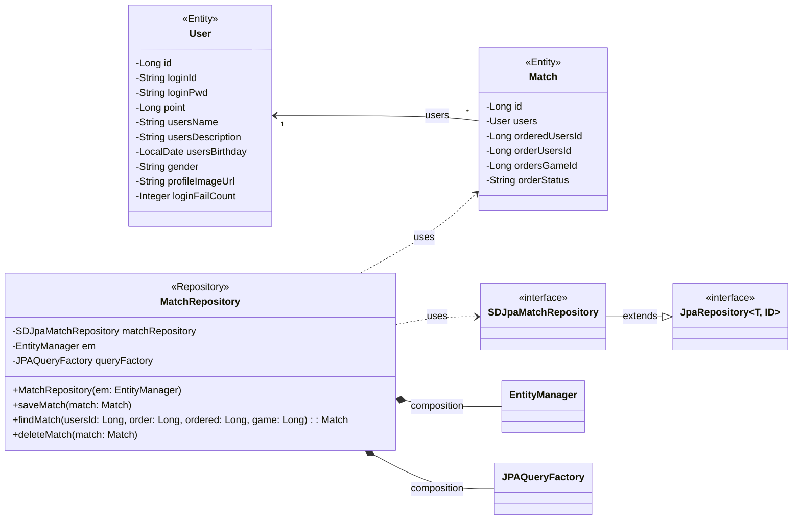

## match class diagram

```mermaid

    classDiagram
    direction LR

    class MatchRepository {
        <<Repository>>
        -SDJpaMatchRepository matchRepository
        -EntityManager em
        -JPAQueryFactory queryFactory
        +MatchRepository(em: EntityManager)
        +saveMatch(match: Match)
        +findMatch(usersId: Long, order: Long, ordered: Long, game: Long): Match
        +deleteMatch(match: Match)
    }

    class Match {
        <<Entity>>
        -Long id
        -User users
        -Long orderedUsersId
        -Long orderUsersId
        -Long ordersGameId
        -String orderStatus
    }

    class User {
        <<Entity>>
        -Long id
        -String loginId
        -String loginPwd
        -Long point
        -String usersName
        -String usersDescription
        -LocalDate usersBirthday
        -String gender
        -String profileImageUrl
        -Integer loginFailCount
    }

    class SDJpaMatchRepository {
        <<interface>>
    }

    class EntityManager {
    }

    class JPAQueryFactory {
    }

    class JpaRepository~T, ID~ {
        <<interface>>
    }

    %% Relationships
    SDJpaMatchRepository --|> JpaRepository : extends
    MatchRepository ..> SDJpaMatchRepository : uses
    MatchRepository *-- EntityManager : composition
    MatchRepository *-- JPAQueryFactory : composition
    MatchRepository ..> Match : uses
    
    User "1" <-- "*" Match : users
```